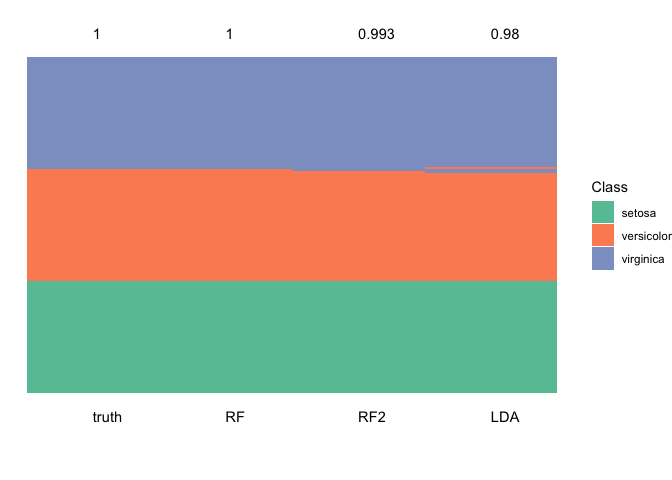
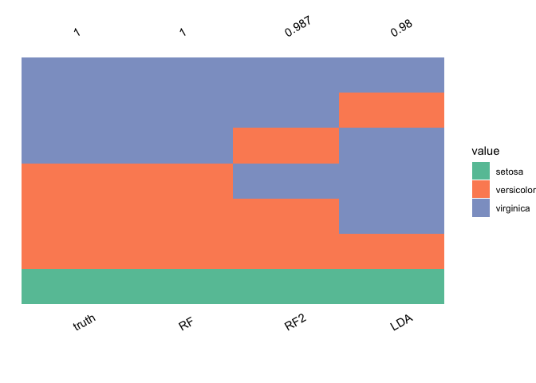
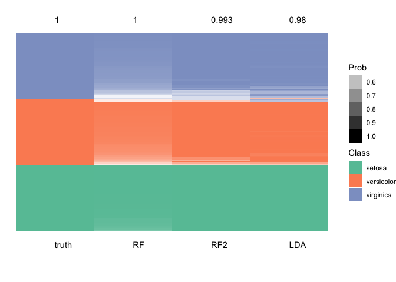

<!-- README.md is generated from README.Rmd. Please edit that file -->

# ensModelVis

The goal of ensModelVis is to display model fits for multiple models and
their ensembles.

## Installation

You can install the development version of ensModelVis from
[GitHub](https://github.com/) with:

``` r
# install.packages("devtools")
devtools::install_github("domijan/ensModelVis")
```

## Example

This is a basic example:

``` r
library(ensModelVis)

data(iris)
if (require("MASS")){
lda.model <- lda(Species~., data = iris)
lda.pred <- predict(lda.model)
}
#> Loading required package: MASS
if (require("ranger")){
ranger.model <- ranger(Species~., data = iris)
ranger.pred <- predict(ranger.model, iris)
}
#> Loading required package: ranger
plot_ensemble(iris$Species,
data.frame(LDA = lda.pred$class,
RF = ranger.pred$predictions))
```



``` r
plot_ensemble(iris$Species,
 data.frame(LDA = lda.pred$class,
  RF = ranger.pred$predictions),
  incorrect = TRUE)
```



``` r
if (require("ranger")){
ranger.model <- ranger(Species~., data = iris, probability = TRUE)
ranger.prob <- predict(ranger.model, iris)
}

plot_ensemble(iris$Species,
  data.frame(LDA = lda.pred$class,
   RF = ranger.pred$predictions),
   tibble_prob = data.frame(LDA = apply(lda.pred$posterior, 1, max),
   RF = apply(ranger.prob$predictions, 1, max)))
```


