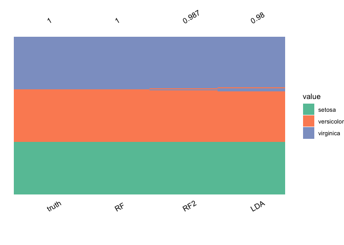
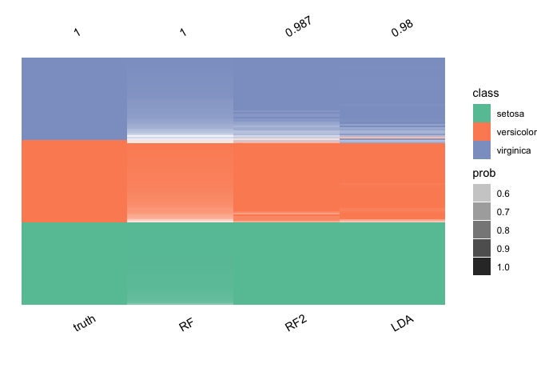

<!-- README.md is generated from README.Rmd. Please edit that file -->

<!-- badges: start -->
[](https://github.com/domijan/ensModelVis/actions/workflows/R-CMD-check.yaml)
<!-- badges: end -->

# ensModelVis

The goal of ensModelVis is to display model fits for multiple models and
their ensembles.

## Installation

You can install the development version of ensModelVis from
[GitHub](https://github.com/) with:

``` r
# install.packages("devtools")
devtools::install_github("domijan/ensModelVis")
```

## Example

This is a basic example:

``` r
library(ensModelVis)

data(iris)
if (require("MASS")) {
  lda.model <- lda(Species ~ ., data = iris)
  lda.pred <- predict(lda.model)
}
#> Loading required package: MASS
if (require("ranger")) {
  ranger.model <- ranger(Species ~ ., data = iris, mtry = 1)
  ranger.pred <- predict(ranger.model, iris)
  ranger.model2 <-
    ranger(Species ~ .,
           data = iris,
           mtry = 4,
           num.trees = 10)
  ranger.pred2 <- predict(ranger.model2, iris)
}
#> Loading required package: ranger


plot_ensemble(
  iris$Species,
  data.frame(
    LDA = lda.pred$class,
    RF = ranger.pred$predictions,
    RF2 = ranger.pred2$predictions
  )
)
```



``` r

plot_ensemble(
  iris$Species,
  data.frame(
    LDA = lda.pred$class,
    RF = ranger.pred$predictions,
    RF2 = ranger.pred2$predictions
  ),
  incorrect = TRUE
)
```


``` r
if (require("ranger")) {
  ranger.model <- ranger(Species ~ ., data = iris, mtry = 1, probability = TRUE)
  ranger.prob <- predict(ranger.model, iris)
   ranger.model2 <-
    ranger(Species ~ .,
           data = iris,
           mtry = 4,
           num.trees = 10,
           probability = TRUE)
  ranger.prob2 <- predict(ranger.model2, iris)
}

plot_ensemble(
  iris$Species,
  data.frame(LDA = lda.pred$class,
             RF = ranger.pred$predictions,
             RF2 = ranger.pred2$predictions),
  tibble_prob = data.frame(
    LDA = apply(lda.pred$posterior, 1, max),
    RF = apply(ranger.prob$predictions, 1, max),
    RF2 = apply(ranger.prob2$predictions, 1, max)
  )
)
```


